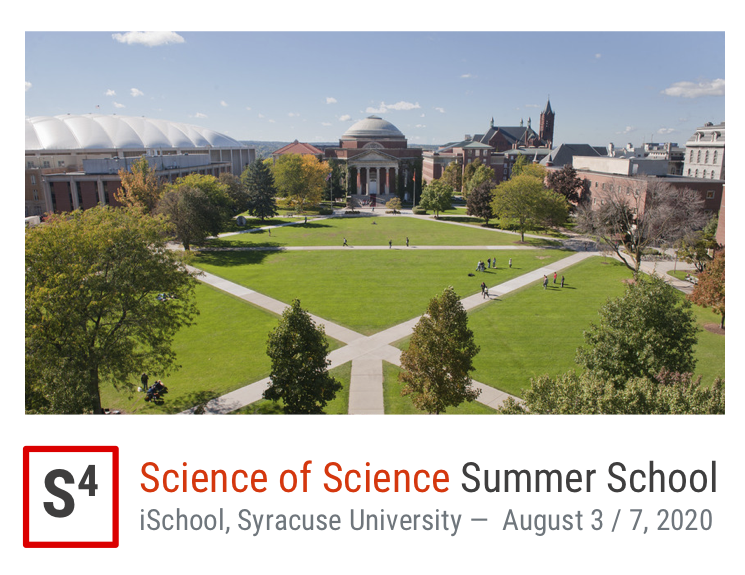

{: .align-center .logo-width  }

**S4 will happen virtually in summer 2021**
{: .notice--danger}

Thanks to the generous funds provided by NSF's [Collaborative Research: Social Dynamics of Knowledge Transfer Through Scientific Mentorship and Publication](https://www.nsf.gov/awardsearch/showAward?AWD_ID=1933803) grant, professors Daniel Acuna (iSchool, Syracuse University) and Stephen V. David (Oregon Health & Science University) are proud to host a Summer School on the Science of Science, or "S4".

This event will bring together PhD students, junior scholars, faculty, and experts in order to gain hands-on experience with vital Science of Science topics. We saw a need for this event when examining other summer schools and workshops -- existing events do not focus entirely on the study of SciSci and take more a methods-based approach rather than question-based. We hope to fill this gap in the Science of Science community.

S4 will be held virtually across two weeks from July 26 to August 6, 2021. The first week will be dedicated to teaching and learning. The second week will be dedicated to mentoring. This event is *free*, but you have to apply. We will have a limited number of 50 participants for this inaugural event. More details about the application soon.

These are a sample of the topics to be covered at S4:

- Computational discovery of new knowledge
- Predictability and analysis of success
- Problems and opportunities in scientific peer review
- Issues in replication and reproducibility
- Economics of science and science policy
- Analysis of open access scientific literature and other scientific artifacts
- Evolution of scientific ideas
- Age, gender, and mentorship effects in science
- Scientific misconduct and computational research integrity
- **Bring your own topic to the school if we have missed something!**

These are some of the techniques you will learn about:

- Machine Learning / Artificial Intelligence
- Network Science / Complex systems
- Informetrics / Scientometrics / Bibliometrics
- Visualization
- Econometrics / Causal inference
- Library Science

## Confirmed speakers/mentors (to be announced)<a name="confirmed-speakers" href="#confirmed-speakers"><i class="fa fa-link"></i></a>

| {: .img}  | [Tim Errington](https://www.linkedin.com/in/tim-errington-558a928/), Director of Research, Center for Open Science  |
| {: .img}  | [James A. Evans](https://sociology.uchicago.edu/directory/james-evans), Professor, Department of Sociology, University of Chicago  |
| {: .img}  | [Vincent Larivière](https://crc.ebsi.umontreal.ca/en/vincent-lariviere/biographie/), Full Professor, Canada Research Chair on the Transformations of Scholarly Communication, l’Université de Montréal  |
| {: .img}  | [Staša Milojević](http://homes.sice.indiana.edu/smilojev/), Associate Professor, Department of Informatics, Indiana University, Bloomington  |
| {: .img}  | [Cassidy R. Sugimoto](https://ella.sice.indiana.edu/~sugimoto/index.php), Professor of Informatics, School of Informatics, Computing, and Engineering, Indiana University, Bloomington  |
|  {: .img} |  [Dashun Wang](https://www.dashunwang.com/), Associate Professor, Kellogg School of Management, Northwestern University |
| {: .img}  | [Bruce Weinberg](https://economics.osu.edu/people/weinberg.27), Professor, Department of Economics, The Ohio State University  |
| {: .img} | [Jevin West](https://jevinwest.org/), Associate Professor, Information School, University of Washington |

## Organizers <a name="organizers" href="#organizers"><i class="fa fa-link"></i></a>

| {: .img} | [Daniel Acuna](https://acuna.io), Assistant Professor, School of Information Studies, Syracuse University |
| {: .img} | [Stephen V. David](https://hearingbrain.org/), Assistant Professor, Oregon Health & Science University |

## Agenda (Preliminary) <a name="agenda" href="#agenda"><i class="fa fa-link"></i></a>

TBA

## Application & Registration <a name="registration" href="#registration"><i class="fa fa-link"></i></a>

**The summer school is free**.

Due to  anticipated interest in S4, there will be an application process that will favor accepting a cohort of 
Ph.D. students, postdocs, and junior faculty that balances affinity and diversity.
{: .notice--warning}

**Important dates**

- Application deadline: **July 2, 2021 at 2:00 PM ET**
- Notifications  of acceptance on **July 6 at 2:00 PM ET**

[Apply](https://syracuseuniversity.qualtrics.com/jfe/form/SV_d51nrgjhLWGpBrg){: .btn .btn--danger .btn--x-large}

## Sponsors <a name="funding" href="#funding"><i class="fa fa-link"></i></a>

This event has been partially funded by the following:

{: .img} [Collaborative Research: Social Dynamics of Knowledge Transfer Through Scientific Mentorship and Publication](https://www.nsf.gov/awardsearch/showAward?AWD_ID=1933803)
